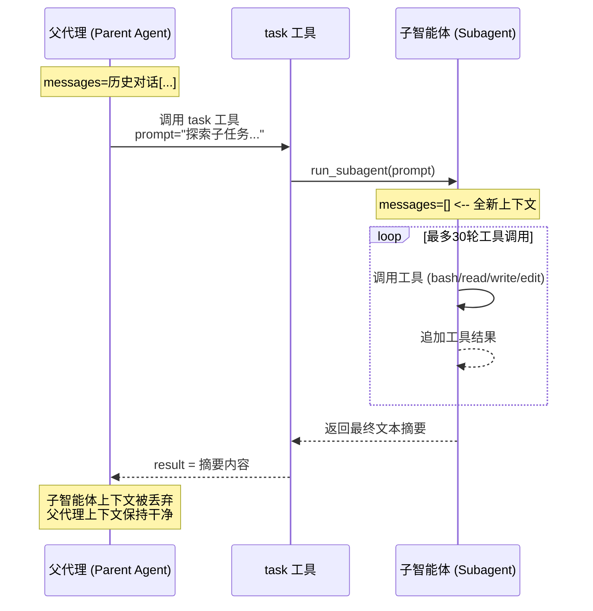

# s04_subagent_1.py — 子智能体（Subagent）实现

## 概述

`s04_subagent_1.py` 演示了一种**父代理（Parent Agent）与子智能体（Subagent）** 的协作模式。父代理持有完整的对话历史，当遇到需要隔离探索的子任务时，通过 `task` 工具生成一个**拥有全新上下文（`messages=[]`）** 的子智能体。子智能体在隔离的上下文中独立工作（共享文件系统但不共享对话历史），最终仅向父代理返回一条摘要文本，随后子智能体的上下文被完全丢弃。

> **核心思想：** 全新的 `messages=[]` 实现了上下文隔离，父代理的对话上下文保持干净。

---

## 核心组件

| 组件 | 说明 |
|------|------|
| `run_subagent(prompt)` | 创建子智能体，传入初始 prompt，在最多 30 轮工具调用后返回最终文本摘要 |
| `agent_loop(messages)` | 父代理的主循环，持续处理消息中的工具调用请求 |
| `TOOL_HANDLERS` | 工具名称到实际执行函数的映射：`bash`、`read_file`、`write_file`、`edit_file` |
| `CHILD_TOOLS` | 子智能体可调用的工具列表（bash、read_file、write_file、edit_file） |
| `PARENT_TOOLS` | 父代理可调用的工具列表（仅 `task`，用于生成子智能体） |
| `run_bash / run_read / run_write / run_edit` | 四个底层工具函数，均受工作目录沙箱保护 |

---

## 架构图：父代理与子智能体交互关系



### 上下文隔离示意

```
父代理上下文                         子智能体上下文
+---------------------+             +----------------------+
| messages=[...]      |             | messages=[]          | <-- 全新
|                     |   dispatch  |                      |
| tool: task          | ----------> | while tool_use:      |
|   prompt="..."      |             |   call tools         |
|   description=""    |             |   append results     |
|                     |   summary   |                      |
|   result = "..."    | <---------  | return last text     |
+---------------------+             +----------------------+
          |                                    |
  父上下文保持干净                    子上下文被丢弃
```

---

## 工作流程

### 主循环（父代理）

1. 从标准输入读取用户问题
2. 将用户消息追加到 `history` 列表
3. 调用 `agent_loop(history)`：
   - 向 API 发送当前消息列表（包含 `task` 工具定义）
   - 若响应无需继续调用工具，则退出循环
   - 若响应用到了 `task` 工具，则调用 `run_subagent(prompt)` 派生子智能体
   - 将工具结果追加回消息列表，继续下一轮

### 子智能体生命周期

1. `run_subagent(prompt)` 创建一个全新的消息列表 `sub_messages = [{"role": "user", "content": prompt}]`
2. 进入最多 30 轮的循环：
   - 调用 Anthropic API（使用 `SUBAGENT_SYSTEM` 和 `CHILD_TOOLS`）
   - 如果 `stop_reason != "tool_use"`，跳出循环
   - 否则遍历所有 `tool_use` 类型的响应块，调用对应的 `TOOL_HANDLERS`
   - 将工具结果追加到子消息列表
3. 提取最终响应中的所有文本块并拼接返回
4. 子智能体的消息列表被丢弃，父代理仅保留摘要文本

---

## 设计要点

1. **上下文隔离**：子智能体从 `messages=[]` 开始，不与父代理共享对话历史，避免上下文污染
2. **文件系统共享**：子智能体和父代理共享同一工作目录 (`WORKDIR`)，可读写同一组文件
3. **工具过滤**：子智能体只能使用 `CHILD_TOOLS` 中的四个工具（bash、read_file、write_file、edit_file），父代理只能使用 `PARENT_TOOLS` 中的 `task` 工具
4. **安全沙箱**：所有路径操作均通过 `safe_path()` 进行校验，防止路径逃逸；`run_bash` 会拦截危险命令
5. **安全上限**：子智能体最多执行 30 轮工具调用，每次工具调用输出限制 50000 字符，防止无限循环或异常大数据
6. **与真实 Claude Code 对比**：本演示采用进程内隔离（in-process），真实 Claude Code 支持 5 种后端（进程内、tmux、iTerm2、fork、远程），且会隔离约 20 个上下文字段（tools、permissions、cwd、env、hooks 等）

---

## 依赖项

| 依赖 | 用途 |
|------|------|
| `anthropic` | Anthropic API 客户端，与大模型交互 |
| `python-dotenv` | 从 `.env` 文件加载环境变量 |
| `subprocess` | 执行 bash 命令（标准库） |
| `pathlib` | 跨平台路径操作（标准库） |
| `os` | 环境变量和路径操作（标准库） |
